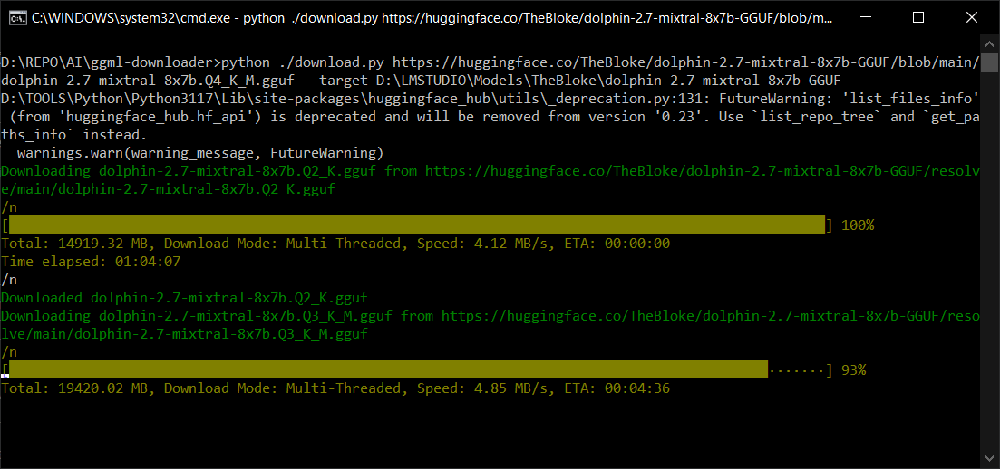

# Hugging Model Downloader
This downloader supports parallel download of multiple chunks and is therefore way faster then the direct browser download. As the models tend to be very large, this is the best way to go.
The downloader works with both GGUF and GGML model files.

## Fork
This is forked from:

[ggml-downloader / the-crypt-keeper](https://github.com/the-crypt-keeper/ggml-downloader) - thank you buddy!

Which I adjusted to my presonal needs and this translates mainly to adding the simplified way to download models by url, fixing the prop checking, adding a destination prop and making it more colorful.

## Libs Installation

`pip install -r requirements.txt`

## Usage via Command Line (CMD) 
### CMD - Simple Url Download
Those who have the full download url can use it in a simple way by just providing the url.

`./download.py <url> [--target <target>]`

`<target>` is optional, it specifies the directory where the downloaded files will be saved. If omitted, files will be saved in the current directory

Example:

`https://huggingface.co/TheBloke/Mixtral-8x7B-MoE-RP-Story-GGUF/resolve/main/mixtral-8x7b-moe-rp-story.Q4_K_M.gguf --target d:\models\`

## CMD - Advanced Download

`./download.py <model> [--quant <quant>] [--branch <branch>] [--target <target>]`

`<model>` can be either the model name you're downloading, for example `TheBloke/Mixtral-8x7B-MoE-RP-Story-GGUF`

`<quant>` is the quantization you're downloading for example `q5_0` (default is `*` which will download all files)

`<branch>` is optional, if omitted will download from first available branch

`<target>` is optional, it specifies the directory where the downloaded files will be saved. If omitted, files will be saved in the current directory

Example A:

`./download.py TheBloke/Mixtral-8x7B-MoE-RP-Story-GGUF --quant Q4_K_M --branch main --target ./models/`

Which would result in the same single file as shown in the simple url example.

Example B:

`./download.py TheBloke/Mixtral-8x7B-MoE-RP-Story-GGUF --target ./models/`

This would result in the download of ALL the quants which is a time saver if it's what you want to do.
